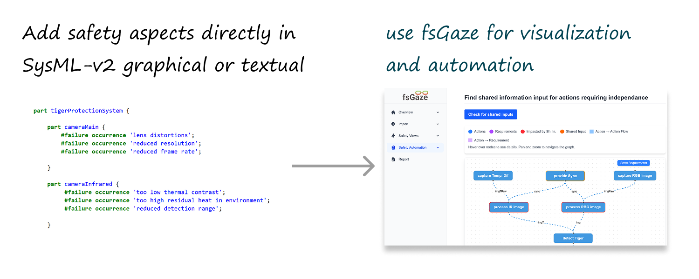

# safety Gaze (sGaze)

A SysML-v2 based Functional Safety Visualization and Verification Tool

## Overview

You can add safety details—like failure modes, effects, and risk ratings—straight into the [SysML-v2](https://www.omg.org/spec/SysML/2.0/Beta2/About-SysML) model, and sGaze takes care of the rest with tailored visualizations and automation for functional safety work.

sGaze is a **Proof of Concept** to show how a domain specific tool can utilize the standardized SysML-v2 API and generate specific diagrams and execute domain specific checks.    

## Key Features

- **Independence**: View safety aspects of your systems regardless of the original modeling tools 
- **Automated Safety Checks**: Use the system and safety model (failure modes, safety requirements etc.) to automate certain checks (e.g. find shared input for actions requiring independence, complexness related checks, etc.) 
- **SysML-v2 Integration**: Use the SysML-v2 API or file based exchange to import the integrated system safety model
- **Customizable Verification Rules**: Define and implement domain-specific safety verification rules
- **x-as-Code support**: Link Sphinx-Needs requirements to SysML-v2 elements and generate safety reports 
- **safety-as-Code support**: You can model the safety aspects ether in graphical or textual SysML-v2 notation.  
- **inspired by**: [OMG RAAML](https://www.omg.org/spec/RAAML/1.0/About-RAAML)

## Architecture

sGaze is built on a flexible graph database architecture that:

- Enables powerful relationship traversal and pattern matching for safety verification
- Provides a scalable foundation for implementing verification algorithms
- Maintains model integrity while allowing for custom safety views

## Use Cases

- Validating functional safety requirements against design and implementation
- Identifying potential safety gaps in system designs
- Tracing safety requirements through to implementation components
- Automating certain compliance checks for safety standards

## Status

This project is currently a Proof of Concept to demonstrate the capabilities of graph-based safety analysis and visualization in a SysML-v2 context.
