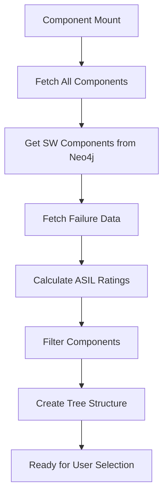
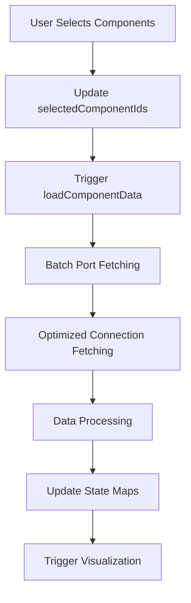
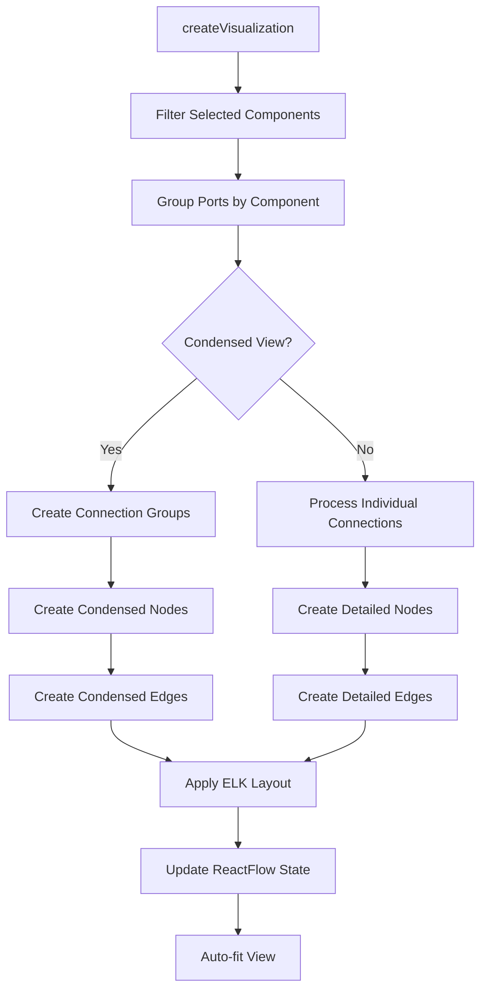

# ArchViewer Component - Data Flow and Rendering Documentation

## Overview

The `ArchViewer.tsx` component is a sophisticated React-based visualization tool that displays software component architecture and their port-based connections. It provides an interactive graph view of AUTOSAR software components, their ports (P-Ports and R-Ports), and the connections between them using ReactFlow for visualization and ELK.js for automatic layout.

## Architecture

### Core Technologies
- **ReactFlow**: Interactive graph visualization framework
- **ELK.js**: Automatic graph layout engine (layered algorithm)
- **Neo4j**: Graph database for storing component and connection data
- **Ant Design**: UI components for controls and interface elements

### Component Structure
```
ArchViewer (ReactFlowProvider wrapper)
├── ArchViewerInner (Main component logic)
├── CustomNode (Component node renderer)
├── DetailView (Selected item details)
└── DetailsModal (Component/connection details)
```

## Data Flow Architecture

### 1. Initial Data Loading Phase



**Key Functions:**
- `getApplicationSwComponents()`: Retrieves all software components from Neo4j
- `getFailuresAndCountsForComponents()`: Fetches failure mode data for ASIL calculation
- Component filtering excludes `COMPOSITION_SW_COMPONENT_TYPE` components

### 2. Component Selection and Data Loading



**Performance Optimizations:**
- **Batch Port Loading**: Single query for all component ports via `getAllPortsForComponents()`
- **Optimized Connection Query**: Uses `getPartnerPortsForComponentsOptimized()` for assembly connector relationships
- **Lazy Loading**: Only loads port and connection data when components are selected

### 3. Visualization Creation Pipeline



**Condensed View Pipeline:**
- Groups all port-to-port connections by component pairs
- Creates single input/output handles per component
- Calculates connection counts and density
- Generates color-coded edges with count labels
- Provides drill-down capability to individual connections

## Data Structures

### Core State Management

```typescript
// Component data
const [allComponents, setAllComponents] = useState<SWComponent[]>([]);
const [allPorts, setAllPorts] = useState<PortInfo[]>([]);

// Connection mappings
const [connections, setConnections] = useState<Map<string, string>>(new Map());
const [portToComponentMap, setPortToComponentMap] = useState<Map<string, string>>(new Map());

// User selections
const [selectedComponentIds, setSelectedComponentIds] = useState<string[]>([]);
const [pendingComponentIds, setPendingComponentIds] = useState<string[]>([]);

// ReactFlow state
const [nodes, setNodes, onNodesChange] = useNodesState([]);
const [edges, setEdges, onEdgesChange] = useEdgesState([]);
```

### Data Models

```typescript
interface SWComponent {
  uuid: string;
  name: string;
  componentType: string;
  arxmlPath: string;
  asil: string; // Calculated from failure modes
}

interface PortInfo {
  name: string;
  uuid: string;
  type: 'P_PORT_PROTOTYPE' | 'R_PORT_PROTOTYPE';
}

interface CustomNodeData {
  label: string;
  component: SWComponent;
  providerPorts: PortInfo[];
  receiverPorts: PortInfo[];
}

interface CondensedNodeData extends CustomNodeData {
  hasProviderConnections: boolean;
  hasReceiverConnections: boolean;
  connectionCounts: {
    outgoing: number;
    incoming: number;
  };
}

interface ConnectionGroup {
  sourceComponentId: string;
  targetComponentId: string;
  connections: Array<{
    sourcePortId: string;
    targetPortId: string;
    sourcePort: PortInfo;
    targetPort: PortInfo;
  }>;
  connectionCount: number;
}
```

## Rendering Pipeline

### 1. Node Rendering (`CustomNode`)

The CustomNode component now supports both detailed and condensed view modes:

```typescript
const CustomNode = ({ data }) => {
  const { condensed = false } = data;
  
  if (condensed) {
    // Condensed view: single handles per side
    return (
      <div>
        {/* Single input handle if component has incoming connections */}
        {data.hasReceiverConnections && (
          <Handle type="target" id={`${data.component.uuid}-input`} />
        )}
        
        {/* Component name with connection count badges */}
        <div>
          {data.label}
          {/* Connection count badges */}
          {(data.connectionCounts.incoming > 0 || data.connectionCounts.outgoing > 0) && (
            <div>
              <Badge count={data.connectionCounts.incoming} />
              <Badge count={data.connectionCounts.outgoing} />
            </div>
          )}
        </div>
        
        {/* Single output handle if component has outgoing connections */}
        {data.hasProviderConnections && (
          <Handle type="source" id={`${data.component.uuid}-output`} />
        )}
      </div>
    );
  } else {
    // Detailed view: individual port handles (original behavior)
    // ... existing implementation
  }
};
```

**Features:**
- **Dual Mode Support**: Seamlessly switches between detailed and condensed views
- **Dynamic Sizing**: Node height adapts to port count (detailed) or fixed height (condensed)
- **ASIL Color Coding**: Background color based on highest failure mode ASIL rating
- **Connection Badges**: Visual indicators for incoming/outgoing connection counts
- **Port Handles**: Individual ports (detailed) or single handles (condensed)
- **Responsive Text**: Color adapts to background brightness

### 2. Edge Creation and Connection Logic

The system supports two edge creation modes:

**Detailed View (Individual Connections):**
```typescript
// Connection processing logic for detailed view
connections.forEach((targetPortUuid, sourcePortUuid) => {
  const sourcePort = allPorts.find(p => p.uuid === sourcePortUuid);
  const targetPort = allPorts.find(p => p.uuid === targetPortUuid);
  
  // Determine correct direction: Provider -> Receiver
  let providerPort, receiverPort;
  if (sourcePort.type === 'P_PORT_PROTOTYPE' && targetPort.type === 'R_PORT_PROTOTYPE') {
    providerPort = sourcePort;
    receiverPort = targetPort;
  } else if (sourcePort.type === 'R_PORT_PROTOTYPE' && targetPort.type === 'P_PORT_PROTOTYPE') {
    // Reverse direction
    providerPort = targetPort;
    receiverPort = sourcePort;
  }
  
  // Create edge from provider component to receiver component
  const edge = {
    id: `${providerComponentUuid}->${receiverComponentUuid}-${edgeCount}`,
    source: providerComponentUuid,
    target: receiverComponentUuid,
    sourceHandle: providerPort.uuid,
    targetHandle: receiverPort.uuid,
    animated: true
  };
});
```

**Condensed View (Grouped Connections):**
```typescript
// Create condensed edges from connection groups
const newEdges = Array.from(connectionGroups.values()).map((group) => {
  const strokeWidth = Math.min(2 + group.connectionCount * 0.5, 8);
  const strokeColor = group.connectionCount > 5 ? '#ff4d4f' : 
                     group.connectionCount > 2 ? '#faad14' : '#52c41a';
  
  return {
    id: `${group.sourceComponentId}->${group.targetComponentId}`,
    source: group.sourceComponentId,
    target: group.targetComponentId,
    sourceHandle: `${group.sourceComponentId}-output`,
    targetHandle: `${group.targetComponentId}-input`,
    style: { strokeWidth, stroke: strokeColor },
    label: `${group.connectionCount}`,
    data: { connectionGroup: group, isCondensed: true }
  };
});
```

**Connection Rules:**
- **Provider to Receiver**: P-Ports connect to R-Ports
- **Bidirectional Detection**: Handles connections in both directions
- **Duplicate Prevention**: Uses sorted UUIDs to create unique connection IDs
- **Component Filtering**: Only shows connections between selected components
- **Density Visualization**: Condensed edges use color and thickness to show connection density

### 3. Layout Algorithm (ELK.js)

```typescript
const elkLayout = async (nodes: Node[], edges: Edge[]) => {
  const elkGraph = {
    id: "root",
    layoutOptions: {
      "elk.algorithm": "layered",
      "elk.direction": "RIGHT", // Left-to-right flow
      "elk.spacing.nodeNode": "80",
      "org.eclipse.elk.layered.spacing.nodeNodeBetweenLayers": "80"
    },
    children: nodes.map(node => ({
      id: node.id,
      width: parseInt(String(node.style?.width)) || 150,
      height: parseInt(String(node.style?.height)) || 80
    })),
    edges: edges.map(edge => ({
      id: edge.id,
      sources: [edge.source],
      targets: [edge.target]
    }))
  };
  
  const layout = await elk.layout(elkGraph);
  // Apply calculated positions to nodes
};
```

**Layout Features:**
- **Hierarchical Layout**: Components arranged in layers
- **Automatic Positioning**: ELK calculates optimal node positions
- **Connection-Aware**: Layout considers edge directions and density
- **Performance**: Async layout prevents UI blocking

## User Interaction Features

### 1. Component Selection
- **Tree Select**: Hierarchical component selection by type
- **Batch Operations**: Select All / Clear All functionality
- **Text Import/Export**: Copy/paste component UUID lists
- **Pending Changes**: Visual feedback for uncommitted selections

### 2. View Modes
- **Detailed View**: Shows individual port-to-port connections (default)
- **Condensed View**: Groups connections by component pairs with count labels
  - Single handles per component side (input/output)
  - Connection count badges on nodes
  - Thicker edges with connection counts
  - Click edges to see individual port connections
  - Color-coded by connection density (green/yellow/red)

### 3. Interactive Visualization
- **Node Highlighting**: Click nodes to highlight connections
- **Edge Selection**: Click edges to highlight specific connections
- **Context Menus**: Right-click for component/connection actions
- **Partner Discovery**: "Show Partners" finds and displays connected components
- **Condensed Edge Details**: Click condensed edges to view all individual connections

### 4. Detail Views
- **Component Details**: Modal with full component information
- **Connection Details**: Shows port-to-port connection specifics
- **Condensed Connection Modal**: Detailed breakdown of grouped connections
- **Port Information**: Interface and failure mode data
- **Navigation**: Direct links to component safety analysis

## Performance Optimizations

### 1. Data Loading
```typescript
// Batch port loading (single query for all components)
const allPortsResult = await getAllPortsForComponents(componentIds);

// Optimized connection query
const partnerResult = await getPartnerPortsForComponentsOptimized(componentIds);
```

### 2. Rendering Optimizations
- **Lazy Visualization**: Only creates nodes/edges for selected components
- **Memoized Calculations**: Uses `useMemo` for expensive computations
- **Efficient Updates**: ReactFlow state updates minimize re-renders
- **Auto-fit View**: Smooth transitions with performance timing

### 3. Memory Management
- **State Cleanup**: Clears ports/connections when no components selected
- **Map-based Lookups**: O(1) component and port lookups
- **Connection Deduplication**: Prevents duplicate edge creation

## Error Handling and Edge Cases

### 1. Data Validation
- **Missing Ports**: Graceful handling of components without ports
- **Invalid Connections**: Skips malformed port connections
- **Component Filtering**: Validates component existence before selection

### 2. UI Robustness
- **Loading States**: Visual feedback during data operations
- **Mobile Responsiveness**: Adaptive panel behavior
- **Theme Support**: Dark/light mode compatibility
- **Error Boundaries**: Graceful failure recovery

## Integration Points

### 1. Neo4j Queries
- **Components**: `getApplicationSwComponents()`
- **Ports**: `getAllPortsForComponents()`, `getPartnerPortsForComponentsOptimized()`
- **Safety**: `getFailuresAndCountsForComponents()`

### 2. External Components
- **ASIL Colors**: `getAsilColor()` for component color coding
- **Theme Provider**: `useTheme()` for dark/light mode
- **Details Modal**: Component and connection detail views
- **Port Interface Info**: Port-specific interface information

### 3. Navigation Integration
- **Component Links**: Direct navigation to component safety analysis
- **UUID Export**: Integration with other tools via component ID lists

## Conclusion

The ArchViewer component provides a comprehensive, high-performance visualization of software component architectures with optimized data loading, interactive exploration, and robust error handling. Its modular design and performance optimizations make it suitable for visualizing complex automotive software systems with hundreds of components and thousands of connections.

**Key Features:**
- **Dual View Modes**: Detailed port-level and condensed component-level visualization
- **Interactive Exploration**: Click-to-drill-down from condensed to detailed connections
- **Performance Optimization**: Efficient batch queries and optimized rendering
- **Visual Density Management**: Color-coded connection density and count indicators
- **Scalable Architecture**: Handles complex systems with graceful degradation

The condensed view feature specifically addresses the challenge of visualizing highly connected systems by providing a high-level overview while maintaining access to detailed information through progressive disclosure.
