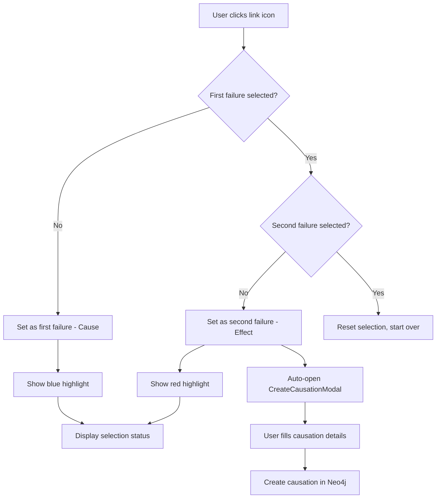
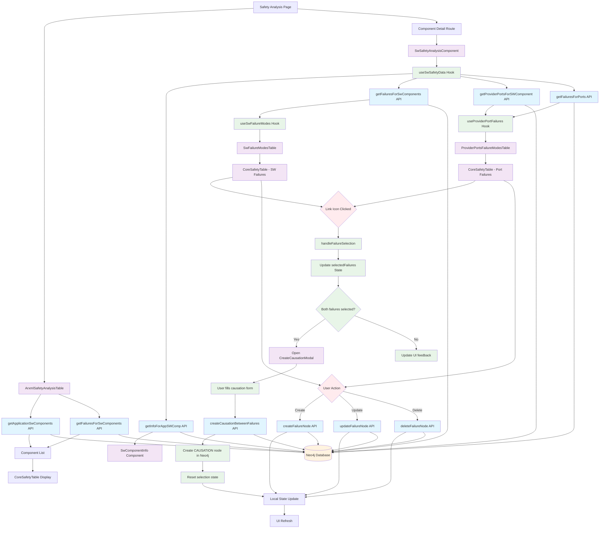

# ARXML Safety Analysis Subsystem

## Ov### 2. **Three-Level Safety Analysis**
-### 6. **Smart UI Behavior**
- "No failures defined" placeholder management
- Optimized state updates to prevent flickering
- Form validation with error messages
- Loading states and user feedback
- Real-time selection state management across tables

### 7. **ASIL Classification**nent Level**: Failure modes directly associated with SW components
- **Provider Port Level**: Failure modes associated with specific provider ports
- **Receiver Port Level**: Failure modes associated with specific receiver portsiew

The ARXML Safety Analysis subsystem is a comprehensive tool for managing and analyzing safety-related failure modes in automotive software components. It provides a user-friendly interface for viewing, creating, editing, and managing failure modes at both the software component level and provider port level. The system now includes advanced causation analysis capabilities for creating relationships between failure modes.

## Architecture

The subsystem follows a modular architecture with clear separation of concerns:

### Core Components

1. **ArxmlSafetyAnalysisTableClean** - Main overview table showing all SW components and their failure modes
2. **SwSafetyAnalysisComponent** - Detailed component-specific safety analysis view with causation linking
3. **CoreSafetyTable** - Reusable table component with editing capabilities and link icons
4. **Safety Analysis Module** - Modular components for specific functionality
5. **FMFlow** - React Flow-based visualization component for failure mode relationships and flow diagrams

### Modular Safety Analysis Components

The `safety-analysis/` directory contains specialized components:

- **SwComponentInfo** - Displays component metadata and statistics
- **SwFailureModesTable** - Manages SW component failure modes with causation linking
- **ProviderPortsFailureModesTable** - Manages provider port failure modes with causation linking
- **ReceiverPortsFailureModesTable** - Manages receiver port failure modes with causation linking
- **BaseFailureModeTable** - Base table component with shared functionality
- **FMFlow** - React Flow visualization for failure mode relationships and causation flows
- **RiskRatingManager** - Component for managing risk ratings and assessments

### Custom Hooks

- **useSwSafetyData** - Central data loading and management
- **useSwFailureModes** - SW component failure operations
- **useProviderPortFailures** - Provider port failure operations
- **useReceiverPortFailures** - Receiver port failure operations
- **useRiskRatingManager** - Risk rating management and operations

## Key Features

### 1. **Two-Level Safety Analysis**
- **Component Level**: Failure modes directly associated with SW components
- **Provider Port Level**: Failure modes associated with specific provider ports

### 2. **CRUD Operations**
- Create new failure modes with validation
- Read and display failure modes in organized tables
- Update existing failure modes (inline editing)
- Delete failure modes with confirmation

### 3. **Advanced Causation Analysis** 🆕
- **Link Icon Integration**: Click link icons (🔗) in table rows to select failure modes
- **Visual Selection Feedback**: Selected failures are highlighted with color coding:
  - First failure (Cause): Blue highlight
  - Second failure (Effect): Red highlight
- **Two-Step Selection Process**:
  1. Click link icon on first failure mode (cause)
  2. Click link icon on second failure mode (effect)
  3. Causation created automatically with confirmation modal
- **Inline Causation Creation**: Direct API calls without separate modal component
- **Cross-Table Linking**: Create causations between SW component failures, provider port failures, and receiver port failures
- **Flow Visualization**: FMFlow component provides React Flow-based visualization of failure mode relationships

### 4. **Advanced Table Features**
- Resizable columns with persistent state
- Pagination with customizable page sizes
- Search and filtering capabilities
- Row grouping for related items
- Icon-only action buttons (edit, delete, add, **link**)
- Visual feedback for selected failure modes

### 5. **Flow Visualization** 🆕
- **React Flow Integration**: Interactive node-based visualization of failure modes
- **Multi-Port Support**: Visualizes both provider and receiver port failures
- **Causation Mapping**: Shows relationships between failure modes graphically
- **Interactive Selection**: Click nodes to select for causation creation

### 6. **Smart UI Behavior**
- "No failures defined" placeholder management
- Optimized state updates to prevent flickering
- Form validation with error messages
- Loading states and user feedback
- Real-time selection state management across tables

### 6. **ASIL Classification**
- Support for ASIL A, B, C, D, and QM levels
- Color-coded ASIL badges for quick identification
- Dropdown selection for ASIL assignment

## Data Model

### Core Entities

```typescript
interface SwComponent {
  uuid: string;
  name: string;
  description?: string;
  arxmlPath?: string;
  componentType?: string;
}

interface Failure {
  failureUuid: string;
  failureName: string | null;
  failureDescription: string | null;
  asil: string | null;
  relationshipType: string;
}

interface ProviderPort {
  name: string;
  uuid: string;
  type: string;
}

interface PortFailure {
  failureUuid: string;
  failureName: string | null;
  failureDescription: string | null;
  asil: string | null;
  failureType: string | null;
  relationshipType: string;
}

// 🆕 Causation Selection State
interface SelectedFailures {
  first: { uuid: string; name: string } | null;
  second: { uuid: string; name: string } | null;
}
```

## Causation Analysis Workflow 🆕

### 1. **Failure Mode Selection**


### 2. **Visual Feedback System**
- **Selection Status Card**: Shows current selection state
- **Link Icon Colors**: 
  - Gray: Available for selection
  - Blue: Selected as cause
  - Red: Selected as effect
- **Row Highlighting**: Selected failure rows have light blue background
- **Tooltips**: Context-sensitive help text

### 3. **Causation Creation Process**
1. **Select Cause**: Click link icon on first failure mode
2. **Select Effect**: Click link icon on second failure mode
3. **Modal Opens**: CreateCausationModal displays automatically
4. **Fill Details**: 
   - Causation type (direct, indirect, conditional)
   - Probability (optional)
   - Name and description
5. **Create**: System creates CAUSATION node in Neo4j with FIRST→THEN relationships

## FMFlow Visualization Component 🆕

### Overview
The `FMFlow` component provides an interactive React Flow-based visualization for failure mode relationships and causation analysis. It offers a graphical representation of SW components, provider ports, receiver ports, and their associated failure modes.

### Key Features
- **Interactive Node Graph**: Visual representation of failure modes as interconnected nodes
- **Multi-Level Visualization**: Shows SW component, provider port, and receiver port failures
- **Causation Mapping**: Displays existing causation relationships between failure modes
- **Interactive Selection**: Click nodes to participate in causation creation workflow
- **Dynamic Layout**: Automatic positioning and layout of nodes based on relationships
- **Real-time Updates**: Responds to data changes and selection state updates

### Technical Implementation
- Built with React Flow library for high-performance node-based interfaces
- Integrates with the same causation selection state as table components
- Supports drag-and-drop node positioning
- Provides zoom and pan controls for large diagrams
- Includes background grid and mini-map for navigation

### Integration with Safety Analysis
- Shares selection state with table components
- Participates in the same two-step causation creation workflow
- Provides visual feedback for selected failure modes
- Supports cross-component causation creation

## Data Flow Architecture



## User Workflows

### 1. **Overview Analysis**
1. User navigates to `/arxml-safety`
2. System loads all SW components with their failure counts
3. User can search, filter, and navigate to detailed analysis
4. User can add new failure modes directly from the overview

### 2. **Detailed Component Analysis**
1. User clicks on a component or navigates to `/arxml-safety/[uuid]`
2. System loads component details, failures, provider ports, and receiver ports
3. User sees three separate tables:
   - SW Component failure modes with link icons
   - Provider port failure modes with link icons
   - Receiver port failure modes with link icons
4. User can view FMFlow visualization of failure mode relationships
5. User can perform CRUD operations on all levels
6. **🆕 User can create causations between any failure modes across all tables**

### 3. **Failure Mode Management**
1. **Add**: Click "Add Failure Mode" → Fill form → Save
2. **Edit**: Click edit icon → Modify inline → Save
3. **Delete**: Click delete icon → Confirm → Remove
4. **🆕 Link**: Click link icon → Select second failure → Create causation

### 4. **Causation Creation Workflow** 🆕
1. **Step 1**: Click link icon (🔗) on first failure mode
   - Failure mode highlighted in blue
   - Selection status card appears
   - Tooltip shows "Selected as Cause"
2. **Step 2**: Click link icon on second failure mode
   - Second failure highlighted in red
   - Causation created automatically via API call
3. **Step 3**: System confirmation
   - Success/error modal displays result
   - API creates relationship in Neo4j
   - Selection state resets automatically
4. **Alternative**: Use FMFlow visualization
   - Click nodes in flow diagram
   - Visual causation creation interface
   - Interactive relationship mapping

## Technical Implementation

### State Management
- Local state with React hooks for UI management
- Optimistic updates for better user experience
- Form state management with Ant Design forms
- **🆕 Causation selection state management across components**

### Props Flow for Causation Features 🆕
```typescript
SwSafetyAnalysisComponent
├── selectedFailures: SelectedFailures
├── handleFailureSelection: (failure) => void
└── Components:
    ├── FMFlow
    │   ├── onFailureSelect={handleFailureSelection}
    │   └── selectedFailures={selectedFailures}
    ├── SwFailureModesTable
    │   ├── onFailureSelect={handleFailureSelection}
    │   └── selectedFailures={selectedFailures}
    ├── ProviderPortsFailureModesTable
    │   ├── onFailureSelect={handleFailureSelection}
    │   └── selectedFailures={selectedFailures}
    └── ReceiverPortsFailureModesTable
        ├── onFailureSelect={handleFailureSelection}
        └── selectedFailures={selectedFailures}
```

### Performance Optimizations
- Separate pagination for each table
- Local state updates instead of full data reloads
- Resizable columns with state persistence
- Debounced search and filtering
- **🆕 Efficient selection state updates**

### Error Handling
- Comprehensive try-catch blocks
- User-friendly error messages
- Validation at form and API levels
- Graceful degradation for missing data
- **🆕 Causation creation error handling**

## File Structure

```
app/arxml-safety/
├── ArxmlSafetyAnalysisTableClean.tsx      # Main overview table
├── page.tsx                               # Main page component
├── [uuid]/
│   └── page.tsx                           # Component detail page
└── components/
    ├── CoreSafetyTable.tsx                # Reusable table component with link icons
    ├── SwSafetyAnalysisComponent.tsx      # Main detail component with causation
    └── safety-analysis/
        ├── SwComponentInfo.tsx            # Component info display
        ├── SwFailureModesTable.tsx        # SW failure table with linking
        ├── ProviderPortsFailureModesTable.tsx # Provider port failure table with linking
        ├── ReceiverPortsFailureModesTable.tsx # Receiver port failure table with linking
        ├── BaseFailureModeTable.tsx       # Base table component with shared functionality
        ├── FMFlow.tsx                     # 🆕 React Flow visualization component
        ├── RiskRatingManager.tsx          # Risk rating management component
        ├── hooks/
        │   ├── useSwSafetyData.ts         # Data loading hook
        │   ├── useSwFailureModes.ts       # SW failure operations
        │   ├── useProviderPortFailures.ts # Provider port failure operations
        │   ├── useReceiverPortFailures.ts # Receiver port failure operations
        │   └── useRiskRatingManager.ts    # Risk rating management operations
        └── types/
            └── index.ts                   # TypeScript interfaces

app/services/
└── ArxmlToNeoService.ts                   # 🆕 Includes createCausationBetweenFailures API
```

## API Integration 🆕

### Causation Management
- **createCausationBetweenFailures**: Creates CAUSATION nodes with FIRST→THEN relationships
- **Neo4j Graph Structure**: 
  ```
  (Failure1)-[:FIRST]->(Causation)-[:THEN]->(Failure2)
  ```

## Future Enhancements

1. **Enhanced Flow Visualization** 🆕 - Expand FMFlow with more interactive features and layout options
2. **Causation Analytics** 🆕 - Analysis of causation chains and impact assessment with metrics
3. **Bulk Causation Operations** 🆕 - Create multiple causations at once
4. **Causation Templates** 🆕 - Predefined causation patterns for common failure scenarios
5. **Enhanced Risk Rating** - Expand risk rating management capabilities
6. **Receiver Port Analysis** - Enhanced receiver port failure analysis features
7. **Bulk Operations** - Support for bulk failure mode operations across all levels
8. **Export/Import** - Export safety analysis to various formats including causations and visualizations
9. **Reporting** - Generate safety analysis reports with causation diagrams and flow charts
10. **Advanced Filtering** - Filter by causation relationships and flow patterns
11. **Real-time Updates** - WebSocket support for collaborative editing
12. **Audit Trail** - Track changes and maintain history
13. **Risk Assessment** - Integration with risk assessment tools using causation data

## Integration Points

### Neo4j Database
- Cypher queries for data retrieval and manipulation
- Relationship management between components and failures
- **🆕 CAUSATION node creation with FIRST/THEN relationships**
- Transaction support for data consistency

### ARXML Import System
- Integration with ARXML importer for component discovery
- Automatic component registration and metadata extraction

### Export System
- Integration with export utilities for safety documentation
- Support for various output formats (PDF, Excel, etc.)
- **🆕 Causation relationship export capabilities**

## Best Practices

1. **Component Modularity** - Each component has a single responsibility
2. **Type Safety** - Comprehensive TypeScript interfaces
3. **Error Boundaries** - Graceful error handling throughout
4. **User Experience** - Consistent UI patterns and feedback
5. **Performance** - Optimized rendering and state management
6. **Accessibility** - ARIA labels and keyboard navigation support
7. **🆕 State Consistency** - Proper state management across causation selection flow
8. **🆕 Visual Feedback** - Clear indication of selection states and actions

## Causation Analysis Benefits 🆕

### For Safety Engineers
- **Traceability**: Clear relationships between failure modes
- **Impact Analysis**: Understand failure propagation paths
- **Risk Assessment**: Quantify causation probabilities
- **Documentation**: Automated relationship documentation

### For System Analysis
- **Dependency Mapping**: Visualize failure dependencies
- **Critical Path Analysis**: Identify high-risk causation chains
- **Mitigation Planning**: Target causation relationships for safety measures
- **Compliance**: Support for ISO 26262 causation requirements
