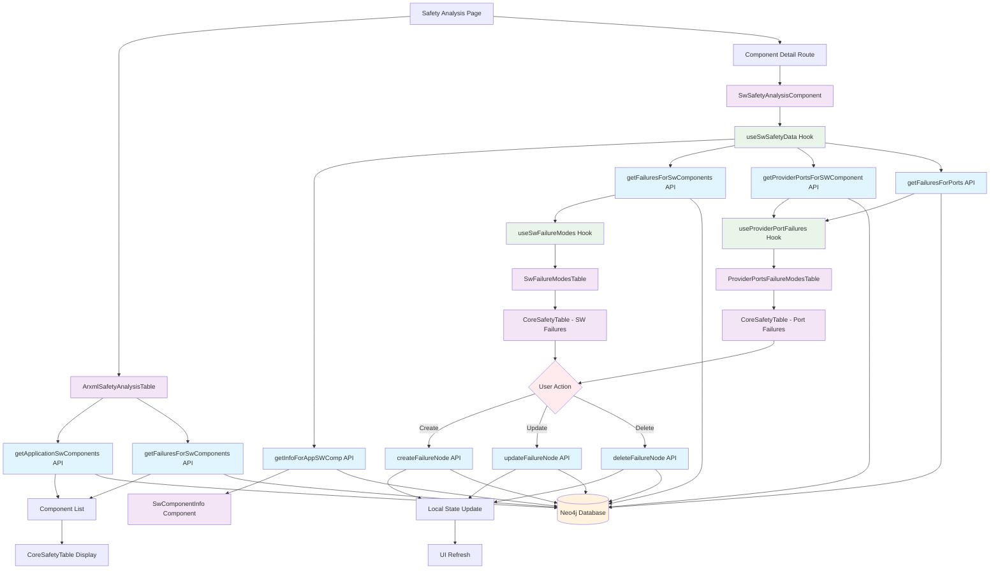

# ARXML Safety Analysis Subsystem

## Overview

The ARXML Safety Analysis subsystem is a comprehensive tool for managing and analyzing safety-related failure modes in automotive software components. It provides a user-friendly interface for viewing, creating, editing, and managing failure modes at both the software component level and provider port level.

## Architecture

The subsystem follows a modular architecture with clear separation of concerns:

### Core Components

1. **ArxmlSafetyAnalysisTable** - Main overview table showing all SW components and their failure modes
2. **SwSafetyAnalysisComponent** - Detailed component-specific safety analysis view
3. **CoreSafetyTable** - Reusable table component with editing capabilities
4. **Safety Analysis Module** - Modular components for specific functionality

### Modular Safety Analysis Components

The `safety-analysis/` directory contains specialized components:

- **SwComponentInfo** - Displays component metadata and statistics
- **SwFailureModesTable** - Manages SW component failure modes
- **ProviderPortsFailureModesTable** - Manages provider port failure modes

### Custom Hooks

- **useSwSafetyData** - Central data loading and management
- **useSwFailureModes** - SW component failure operations
- **useProviderPortFailures** - Provider port failure operations

## Key Features

### 1. **Two-Level Safety Analysis**
- **Component Level**: Failure modes directly associated with SW components
- **Provider Port Level**: Failure modes associated with specific provider ports

### 2. **CRUD Operations**
- Create new failure modes with validation
- Read and display failure modes in organized tables
- Update existing failure modes (inline editing)
- Delete failure modes with confirmation

### 3. **Advanced Table Features**
- Resizable columns with persistent state
- Pagination with customizable page sizes
- Search and filtering capabilities
- Row grouping for related items
- Icon-only action buttons (edit, delete, add)

### 4. **Smart UI Behavior**
- "No failures defined" placeholder management
- Optimized state updates to prevent flickering
- Form validation with error messages
- Loading states and user feedback

### 5. **ASIL Classification**
- Support for ASIL A, B, C, D, and QM levels
- Color-coded ASIL badges for quick identification
- Dropdown selection for ASIL assignment

## Data Model

### Core Entities

```typescript
interface SwComponent {
  uuid: string;
  name: string;
  description?: string;
  arxmlPath?: string;
  componentType?: string;
}

interface Failure {
  failureUuid: string;
  failureName: string | null;
  failureDescription: string | null;
  asil: string | null;
  relationshipType: string;
}

interface ProviderPort {
  name: string;
  uuid: string;
  type: string;
}
```

## Data Flow Architecture



## User Workflows

### 1. **Overview Analysis**
1. User navigates to `/arxml-safety`
2. System loads all SW components with their failure counts
3. User can search, filter, and navigate to detailed analysis
4. User can add new failure modes directly from the overview

### 2. **Detailed Component Analysis**
1. User clicks on a component or navigates to `/arxml-safety/[uuid]`
2. System loads component details, failures, and provider ports
3. User sees two separate tables:
   - SW Component failure modes
   - Provider port failure modes
4. User can perform CRUD operations on both levels

### 3. **Failure Mode Management**
1. **Add**: Click "Add Failure Mode" → Fill form → Save
2. **Edit**: Click edit icon → Modify inline → Save
3. **Delete**: Click delete icon → Confirm → Remove

## Technical Implementation

### State Management
- Local state with React hooks for UI management
- Optimistic updates for better user experience
- Form state management with Ant Design forms

### Performance Optimizations
- Separate pagination for each table
- Local state updates instead of full data reloads
- Resizable columns with state persistence
- Debounced search and filtering

### Error Handling
- Comprehensive try-catch blocks
- User-friendly error messages
- Validation at form and API levels
- Graceful degradation for missing data

## File Structure

```
app/arxml-safety/
├── ArxmlSafetyAnalysisTable.tsx           # Main overview table
├── page.tsx                               # Main page component
├── [uuid]/
│   └── page.tsx                           # Component detail page
└── components/
    ├── CoreSafetyTable.tsx                # Reusable table component
    ├── SwSafetyAnalysisComponent.tsx      # Main detail component
    └── safety-analysis/
        ├── SwComponentInfo.tsx            # Component info display
        ├── SwFailureModesTable.tsx        # SW failure table
        ├── ProviderPortsFailureModesTable.tsx # Port failure table
        ├── hooks/
        │   ├── useSwSafetyData.ts         # Data loading hook
        │   ├── useSwFailureModes.ts       # SW failure operations
        │   └── useProviderPortFailures.ts # Port failure operations
        └── types/
            └── index.ts                   # TypeScript interfaces
```

## Future Enhancements

1. **Bulk Operations** - Support for bulk failure mode operations
2. **Export/Import** - Export safety analysis to various formats
3. **Reporting** - Generate safety analysis reports
4. **Advanced Filtering** - More sophisticated filtering options
5. **Real-time Updates** - WebSocket support for collaborative editing
6. **Audit Trail** - Track changes and maintain history
7. **Templates** - Predefined failure mode templates
8. **Risk Assessment** - Integration with risk assessment tools

## Integration Points

### Neo4j Database
- Cypher queries for data retrieval and manipulation
- Relationship management between components and failures
- Transaction support for data consistency

### ARXML Import System
- Integration with ARXML importer for component discovery
- Automatic component registration and metadata extraction

### Export System
- Integration with export utilities for safety documentation
- Support for various output formats (PDF, Excel, etc.)

## Best Practices

1. **Component Modularity** - Each component has a single responsibility
2. **Type Safety** - Comprehensive TypeScript interfaces
3. **Error Boundaries** - Graceful error handling throughout
4. **User Experience** - Consistent UI patterns and feedback
5. **Performance** - Optimized rendering and state management
6. **Accessibility** - ARIA labels and keyboard navigation support
