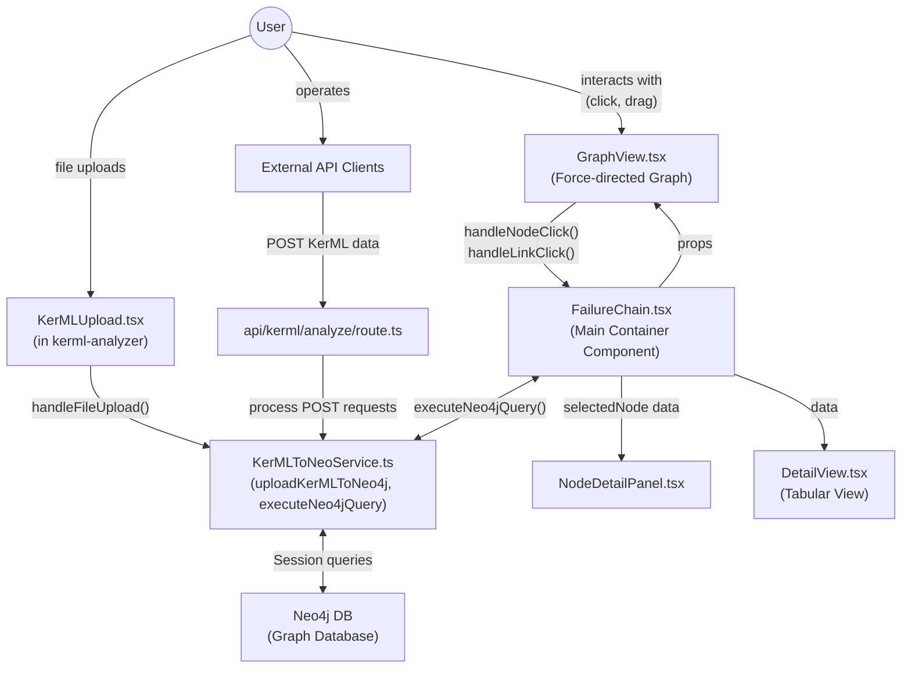

# Causal Chain Component Overview

## Introduction

The Causal Chain component is a core module in the fsGaze application that visualizes and manages causal relationships between system elements and failure modes. This document describes the actual implementation, architecture, and data flows between the Causal Chain component and other parts of the application.

## Actual Implementation Architecture

The Causal Chain component follows a modular design pattern that integrates with Neo4j as its primary data store. The component visualizes failure chains by querying structured graph data:



## Actual Data Flow

### 1. KerML Data Import Flow

The data flow begins with the KerML import process:

* The `KerMLToNeoService.ts` service handles uploading KerML content to Neo4j
* KerML data can be imported via:
  * The File Upload component in the UI
  * The REST API endpoint at `api/kerml/analyze` (defined in `C:\SG2\fsgaze\app\api\kerml\analyze\route.ts`)
* KerML data is parsed as JSON and transformed into a graph structure
* Nodes (PartUsage, OccurrenceUsage, MetadataUsage, etc.) are created with appropriate properties
* Relationships between nodes are established based on the KerML structure
* Indexes are created to optimize query performance

```typescript
// Sample of how KerML data is processed in KerMLToNeoService.ts
export const uploadKerMLToNeo4j = async (kermlContent: string, fileName: string = 'unknown') => {
  // Parse KerML content as JSON
  const jsonObjects = JSON.parse(kermlContent);
  
  // Create nodes and relationships in Neo4j
  const result = await createNodesAndRelationships(jsonObjects, session);
  
  // Record import metadata
  await session.run(
    `CREATE (i:ImportInfo {timestampUploadDB: $timestamp, fileName: $fileName})`,
    { timestamp, fileName }
  );
}
```

### 2. Failure Chain Visualization Flow

The Causal Chain component retrieves and visualizes data:

* The React-based FailureChain component queries Neo4j through the `executeNeo4jQuery` service
* First, it retrieves parts and their associated failure modes:
  ```
  MATCH (pu:PartUsage)
  OPTIONAL MATCH (pu)-[:links{member:true}]-(ou:OccurrenceUsage)-[:links{member:true}]-(mu:MetadataUsage)-[:links{definition:true}]-(md:MetadataDefinition {name: 'FailureModeMetadata'})
  ```

* Next, it queries failure mode effects to establish causal chains:
  ```
  MATCH (occurrence:OccurrenceUsage)
  WHERE occurrence.elementId IN [...]
  MATCH (occurrence)<-[:links{chainingFeature:true}]-(feature:Feature)
  MATCH (feature)<-[:links{relatedElement:true}]-(succession:SuccessionAsUsage)
  // ...additional pattern matching to find effects
  ```

* The data is transformed into a graph structure with nodes and links for visualization
* A force-directed graph visualization renders the causal chains

### 3. Caching and Performance Optimization

To improve performance with large datasets:

* Query results are cached in memory using a `Map` structure to avoid redundant database queries
* Data is loaded incrementally with pagination (controlled by `dataLimit` state)
* Processing of large datasets is performed in phases with loading indicators

### 4. User Interaction Flow

The interface enables several user interactions:

* Toggling between full view (parts and failure modes) and failure-mode-only view
* Highlighting and selection of nodes to view detailed information
* Manual arrangement of the graph through drag-and-drop
* Expanding the dataset by loading additional records

## Component Implementation

The Causal Chain component consists of several React components:

* **FailureChain** (main container): Manages data fetching and state
* **GraphView**: Renders the force-directed graph visualization
* **DetailView**: Provides tabular representation of the data
* **NodeDetailPanel**: Shows detailed information about selected nodes

## Technical Implementation Details

1. **Data Retrieval**:
   * Uses Cypher queries via the `executeNeo4jQuery` service
   * Implements multi-phase data loading with progress tracking
   * Applies caching to optimize performance

2. **Visualization**:
   * Leverages `react-force-graph-2d` for graph rendering
   * Uses D3.js forces for node positioning and simulation
   * Custom node rendering with HTML5 Canvas for better performance
   * Distinct visual styling for different node types (parts vs. failure modes)

3. **State Management**:
   * React state hooks for UI component state
   * Memoized data processing with useCallback/useEffect
   * Progressive data loading with pagination

## Future Enhancements

Planned improvements to the Causal Chain component include:

* Enhanced filtering capabilities for complex failure networks
* Export options for graph data and visualizations
* (Machine learning for suggesting potential causal relationships)
