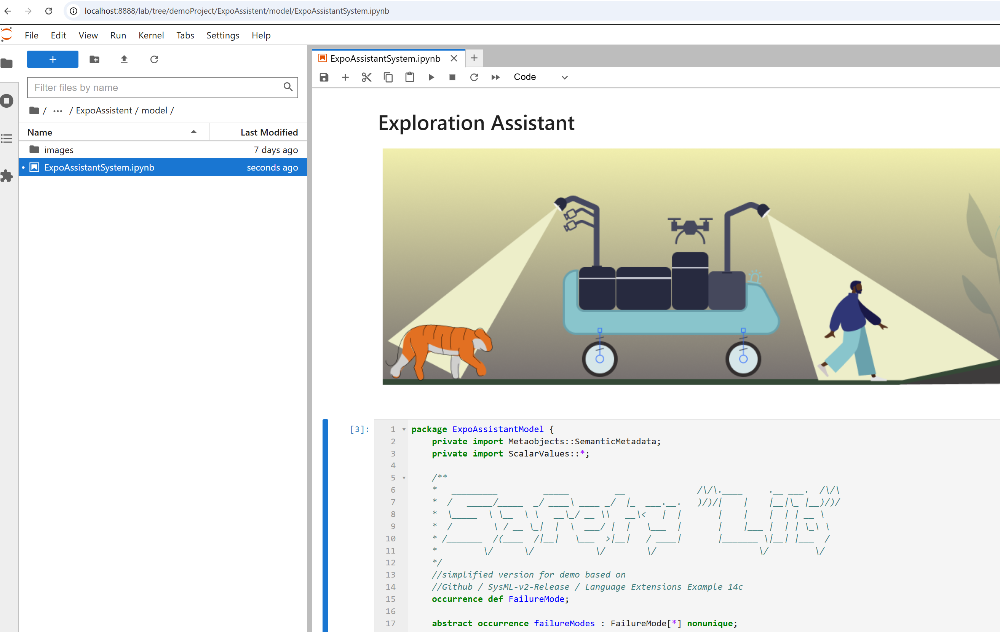
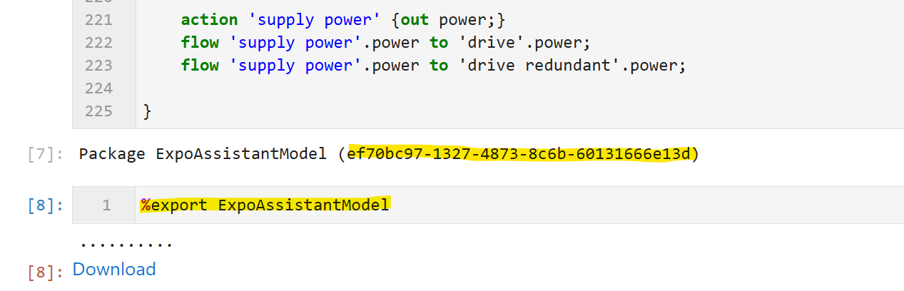
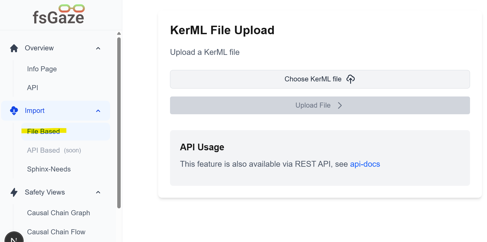

# Exploration Assistant

This demonstration project is used as the reference for fsGaze and it showcases the integration between SysML v2 and Sphinx Needs.

SysML v2 already incorporates requirements as native model elements, making Sphinx Needs optional for fsGaze implementations. However, fsGaze provides support for projects that prefer Sphinx Needs for requirement management and traceability. This support includes importing Sphinx Needs requirements and generating Sphinx Needs-based reports that integrate with your project documentation.

## SysML-v2 installation

To set-up the SysML-v2 enviroment see https://github.com/Systems-Modeling/SysML-v2-Release/tree/master/install/jupyter

## Edit the system model
After installing the Juypyter open the .ipynb file ExpoAssistantSystem and if you want add more model elements.
**IMPORTANT:** fsGaze is currently optimized exclusively for the types defined in the SafetyLib, which serves as the safety "language add-on" for SysML-v2 at the beginning of the SysML-v2 demo project file.  
Any modifications to the SafetyLib will require corresponding updates to the Cypher queries and the user interface (UI) to maintain compatibility.
- failure
- causation
- SafetyReq
But you can add new requirements, actions, etc. just use the same notation as defined in the SafetyLib, e.g. #failure occurrence 'wrong animal detected';



## Export the SysML-v2 model to .json
- Press strg+enter in jupyter to generate the model
- Export the SysML-v2 model with the command "%export ExpoAssistantModel"




## Import the .json model in fsGaze
Now you can import the .json model and explore 



## Import via fsGaze-API
navigate to http://localhost:3000/api-docs 

## Imort the SysML-v2 model via SysML-v2 API
- TBD not yet fully implemented


## Optional sphinx needs setup

The following instruction is related to sphinx needs setup.
First read the sphinx needs instructions see https://sphinx-needs.readthedocs.io/en/latest/installation.html

create the virtual enviroment (.venv) by running

```bash
python -m venv .venv
```

activate the .venv

```bash
.venv\Scripts\activate
```

install the packages from requirements.txt then generate html and the needs.json

```bash
pip install -r requirements.txt
```

generate html and the needs.json

```bash
sphinx-build -b html source build/html
```

if the sphinx-build is not working

1. check if .venv is activated
2. check if sphinx is installed

```bash
pip show sphinx
```
