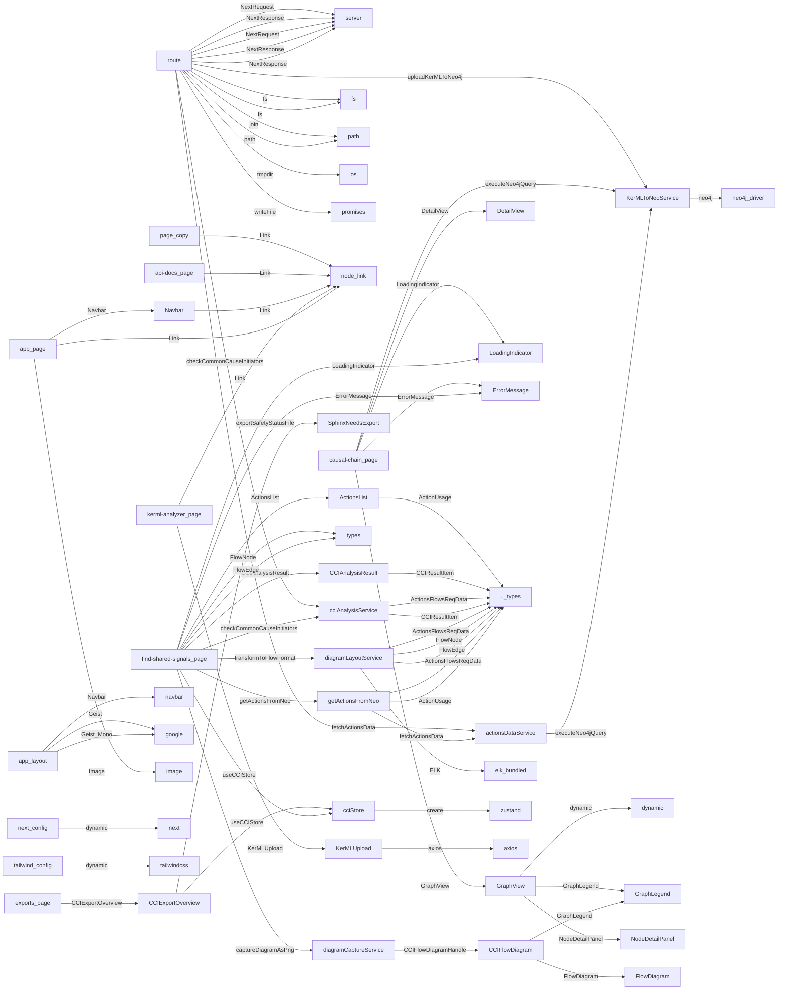

# Project Import Diagram

Generated on 2025-03-29

## File Name Mapping

| Node ID | Original Name | File Path |
| ------- | ------------- | --------- |
| .._types | ../types | C:\SG2\fsgaze\app\find-shared-signals\types.ts |
| actionsDataService | actionsDataService | app/services/actionsDataService |
| ActionsList | ActionsList | C:\SG2\fsgaze\app\find-shared-signals\components\ActionsList.tsx |
| api-docs_page | api-docs/page | app/api-docs/page.tsx |
| app_layout | app/layout | app/layout.tsx |
| app_page | app/page | app/page.tsx |
| axios | axios | axios |
| causal-chain_page | causal-chain/page | app/causal-chain/page.tsx |
| CCIAnalysisResult | CCIAnalysisResult | C:\SG2\fsgaze\app\find-shared-signals\components\CCIAnalysisResult.tsx |
| cciAnalysisService | cciAnalysisService | C:\SG2\fsgaze\app\find-shared-signals\services\cciAnalysisService.ts |
| CCIExportOverview | CCIExportOverview | C:\SG2\fsgaze\app\exports\components\CCIExportOverview.tsx |
| CCIFlowDiagram | CCIFlowDiagram | C:\SG2\fsgaze\app\find-shared-signals\components\CCIFlowDiagram.tsx |
| cciStore | cciStore | C:\SG2\fsgaze\app\find-shared-signals\store\cciStore.ts |
| DetailView | DetailView | C:\SG2\fsgaze\app\causal-chain\components\DetailView.tsx |
| diagramCaptureService | diagramCaptureService | C:\SG2\fsgaze\app\find-shared-signals\services\diagramCaptureService.ts |
| diagramLayoutService | diagramLayoutService | C:\SG2\fsgaze\app\find-shared-signals\services\diagramLayoutService.ts |
| dynamic | dynamic | next/dynamic |
| elk_bundled | elk.bundled | elkjs/lib/elk.bundled.js |
| ErrorMessage | ErrorMessage | C:\SG2\fsgaze\app\find-shared-signals\components\ErrorMessage.tsx |
| ExportPath | ExportPath | app/exports/components/ExportPath.tsx |
| exports_page | exports/page | app/exports/page.tsx |
| find-shared-signals_page | find-shared-signals/page | app/find-shared-signals/page.tsx |
| find-shared-signals_types | find-shared-signals/types | app/find-shared-signals/types.ts |
| FlowDiagram | FlowDiagram | C:\SG2\fsgaze\app\find-shared-signals\components\FlowDiagram.tsx |
| fs | fs | fs |
| getActionsFromNeo | getActionsFromNeo | C:\SG2\fsgaze\app\find-shared-signals\services\getActionsFromNeo.ts |
| google | google | next/font/google |
| GraphLegend | GraphLegend | C:\SG2\fsgaze\app\find-shared-signals\components\GraphLegend.tsx |
| GraphView | GraphView | C:\SG2\fsgaze\app\causal-chain\components\GraphView.tsx |
| image | image | next/image |
| kerml-analyzer_page | kerml-analyzer/page | app/kerml-analyzer/page.tsx |
| KerMLToNeoService | KerMLToNeoService | C:\SG2\fsgaze\app\services\KerMLToNeoService.ts |
| KerMLUpload | KerMLUpload | app/kerml-analyzer/components/KerMLUpload |
| node_link | link | next/link |
| LoadingIndicator | LoadingIndicator | C:\SG2\fsgaze\app\find-shared-signals\components\LoadingIndicator.tsx |
| navbar | navbar | C:\SG2\fsgaze\app\components\navbar.tsx |
| Navbar | Navbar | C:\SG2\fsgaze\app\components\Navbar.tsx |
| neo4j_driver | neo4j-driver | neo4j-driver |
| neo4j_config | neo4j.config | app/services/neo4j.config.ts |
| next | next | next |
| next_env_d | next-env.d | next-env.d.ts |
| next_config | next.config | next.config.ts |
| NodeDetailPanel | NodeDetailPanel | C:\SG2\fsgaze\app\causal-chain\components\NodeDetailPanel.tsx |
| os | os | os |
| page_copy | page copy | app/api-docs/page copy.tsx |
| path | path | path |
| promises | promises | fs/promises |
| route | route | app/api/swagger/route.ts |
| server | server | next/server |
| server_test | server-test | server-test.js |
| SphinxNeedsExport | SphinxNeedsExport | C:\SG2\fsgaze\app\exports\services\SphinxNeedsExport.ts |
| tailwind_config | tailwind.config | tailwind.config.js |
| tailwindcss | tailwindcss | tailwindcss |
| types | types | C:\SG2\fsgaze\app\find-shared-signals\types.ts |
| zustand | zustand | zustand |
